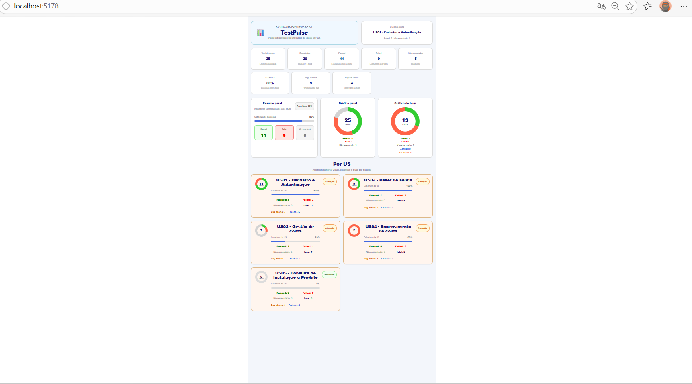

# 📊 TestPulse Dashboard

Dashboard de acompanhamento de execução de testes e bugs por User Story.

🔗 **Demo:** https://testpulse-dashboard.vercel.app
💻 **GitHub:** https://github.com/kdantas0/testpulse-dashboard

---

## 🚀 Tecnologias

* React + Vite
* TypeScript
* Visualização com gráficos customizados

---

## 📊 Funcionalidades

* KPI de execução
* Cobertura de testes
* Pass rate
* Bugs por US (abertos e fechados)
* Identificação de US crítica
* Gráficos visuais (execução e bugs)
* Dashboard por User Story

---

## 🖼️ Preview



---

## ▶️ Como rodar o projeto

### 1. Clonar o repositório

```bash
git clone https://github.com/kdantas0/testpulse-dashboard.git
```

### 2. Acessar a pasta

```bash
cd testpulse-dashboard
```

### 3. Instalar dependências

```bash
npm install
```

### 4. Rodar o projeto

```bash
npm run dev
```

### 5. Abrir no navegador

http://localhost:5173

---

## ⚙️ Como usar o dashboard

Os dados são alimentados manualmente no arquivo:

```
src/dailyReport.ts
```

### Exemplo de estrutura:

```ts
{
  us: "US01 - Cadastro e Autenticação",
  passed: 8,
  failed: 3,
  notExecuted: 0,
  bugsOpen: 3,
  bugsClosed: 3,
}
```

---

## 📈 O que o sistema calcula automaticamente

* Total de testes
* Cobertura (%)
* Status da US:

  * 🟢 Saudável
  * 🟡 Parcial
  * 🔴 Atenção
* Gráficos de execução
* Gráficos de bugs

---

## 🧠 Possíveis evoluções

* Integração com Cypress (Mochawesome JSON)
* Pipeline CI/CD com GitHub Actions
* Atualização automática dos dados
* Exportação de relatórios

---

## 👨‍💻 Autor

Kleber Coutinho Dantas
Senior QA Automation Engineer
